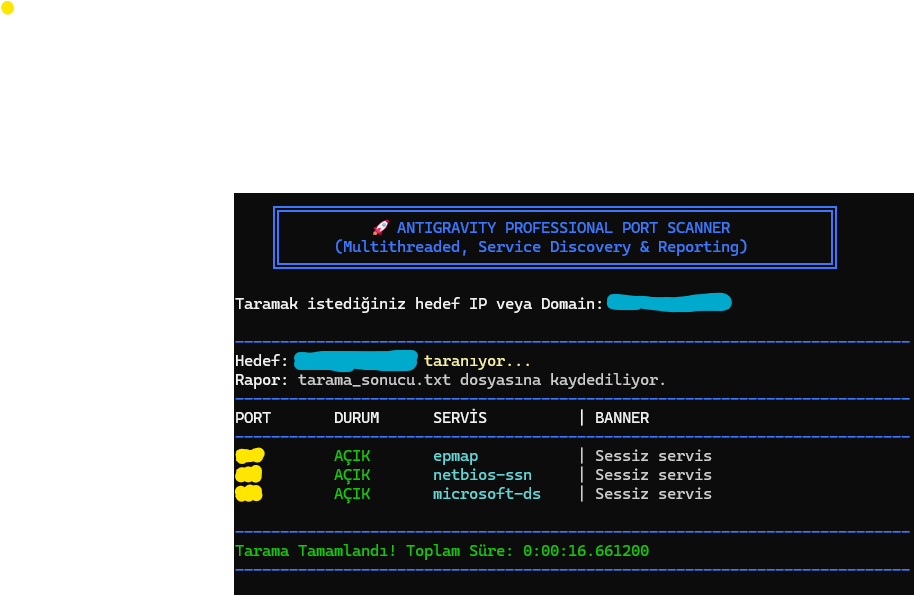
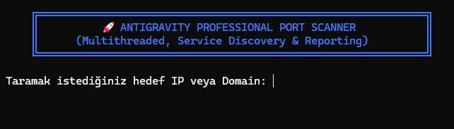

# 🚀 Profesyonel Port Tarayıcı (Professional Port Scanner)


**Profesyonel Port Tarayıcı**, ağ uzmanları ve siber güvenlik meraklıları için Python ile geliştirilmiş, süper hızlı, çoklu iş parçacıklı (multithreaded) bir ağ tarama aracıdır. Sadece açık portları tespit etmekle kalmaz, aynı zamanda servis keşfi (service discovery) ve banner grabbing tekniklerini kullanarak hedef sistem hakkında kritik bilgiler toplar ve bulgularını otomatik olarak raporlar.

## 🔥 Temel Özellikler

-**⚡ Süper Hızlı Tarama (Multithreading):** ThreadPoolExecutor kullanarak aynı anda yüzlerce portu tarar, tarama süresini dakikalardan saniyelere indirir.

-**🔍 Servis Keşfi & Banner Grabbing:** Açık portların arkasındaki servislerin adlarını ve versiyon bilgilerini (SSH, FTP, vb.) yakalamaya çalışır.

-**📊 Otomatic Raporlama:** Tüm tarama sonuçlarını, zaman damgaları ve sistem bilgileriyle birlikte otomatik olarak tarama_sonucu.txt dosyasına kaydeder.

-**🛡️ Gelişmiş Hata Yönetimi:** Ağ kopmaları, geçersiz adresler veya kullanıcı iptalleri (Ctrl+C) gibi durumlarda çökmez, zarifçe kapanır.

-**✅ Temiz & Profesyonel Çıktı:** Bulguları terminalde hizalanmış, okuması kolay bir tablo formatında sunar.

## ⚙️ Çalışma Mantığı

Araç, hedef sistemdeki her bir port için bir TCP soketi oluşturur ve **TCP Three-Way Handshake** sürecini başlatır.

- **Açık Port:** `connect_ex` fonksiyonu `0` (SYN/ACK alındı) döner.
- **Kapalı Port:** Hedef `RST` paketi döner veya zaman aşımı oluşur.

## 📸 Görseller





## 🚀 Kurulum ve Kullanım

### 1. Hazırlık

**Gereksinimler**
    - Python 3.8 veya üzeri
    - socket kütüphanesi (Python ile yüklü gelir)
    

**Depoyu klonlayın**`

```bash
git clone https://github.com/Omer-Murat/Profesyonel-Port-Taray-c-Professional-Port-Scanner-.git
cd Profesyonel-Port-Taray-c-Professional-Port-Scanner-
```

**(Önerilen) Bir sanal ortam oluşturun ve aktif hale getirin**

```bash

# Sanal ortam oluşturma

# Windows
python -m venv venv

# macOS/Linux
python3 -m venv venv

# Aktifleştirme 

# Windows
venv\Scripts\activate

# Linux/Mac
source venv/bin/activate

```

# Çalıştırma 

```bash

#Programı başlatın ve hedef IP adresini girin:
python port_scanner.py

```
Tarama tamamlandığında, bulunan açık portlar terminalde listelenecek ve otomatik olarak tarama_sonucu.txt dosyasına kaydedilecektir.

## Örnek Çıktı

```bash
---------------------------------------------------------------------------
Hedef: 192.168.1.104 (Multithreaded Tarama Başlatılıyor...)
---------------------------------------------------------------------------
PORT       DURUM      SERVİS          | BANNER
---------------------------------------------------------------------------
135        AÇIK       epmap           | Sessiz servis
139        AÇIK       netbios-ssn     | Sessiz servis
445        AÇIK       microsoft-ds    | Sessiz servis
---------------------------------------------------------------------------
Tarama Tamamlandı! Toplam Süre: 0:00:16.662534
---------------------------------------------------------------------------

```

## ⚖️ Yasal Uyarı (Disclaimer)

Bu araç sadece eğitim ve etik hackleme amaçları için geliştirilmiştir. İzin almadan herhangi bir sisteme karşı port taraması yapmak yasa dışıdır ve ciddi sonuçlar doğurabilir. Bu aracın yanlış kullanımından doğacak sorumluluk tamamen kullanıcıya aittir. Geliştirici, bu araçla yapılan hiçbir işlemden sorumlu tutulamaz.
